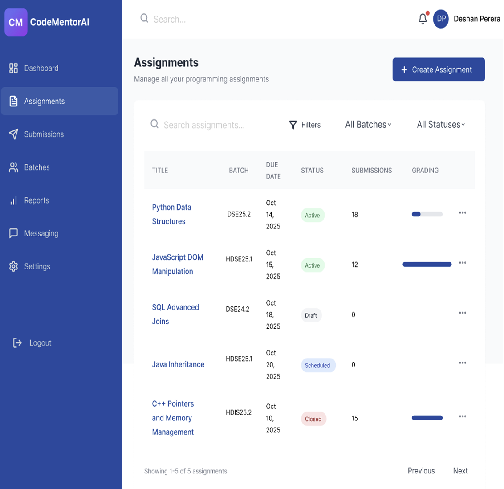
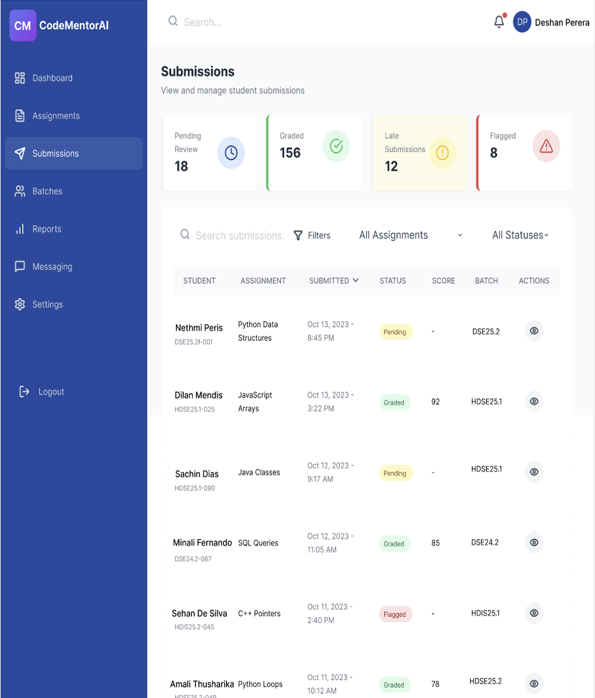
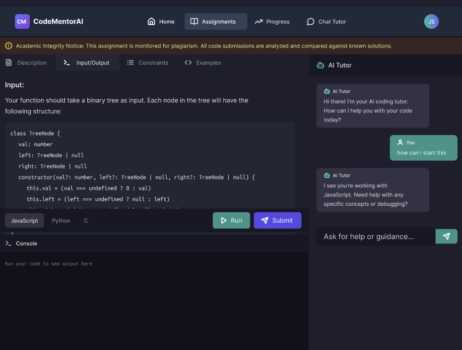

# 💻 Code-MentorAI
### AI-Powered Programming Learning Platform

> A web-based AI learning platform that guides students through programming concepts step-by-step — teaching them *how to think*, not just how to copy code.


---

## 📌 Overview

**Code-MentorAI** is a web-based AI learning platform designed to help students learn programming in a smarter way. Instead of giving direct answers, the system guides students through hints, explanations, and step-by-step problem solving.

It also helps instructors monitor student progress, manage assignments, and ensure academic integrity in coding assessments.

---

## 🚨 Problem

### Students struggle with:
| Issue | Consequence |
|---|---|
| Over-reliance on AI tools | Copy answers without understanding |
| Weak problem-solving skills | Fail in real coding situations |
| No guided learning structure | Fall behind without knowing why |

### Instructors struggle with:
| Issue | Consequence |
|---|---|
| Plagiarism is hard to detect | Academic dishonesty goes unnoticed |
| No visibility into student thinking | Hard to give meaningful feedback |
| Limited progress tracking tools | Difficult to identify struggling students |

---

## 💡 Solution

Code-MentorAI addresses these gaps by:

- ✅ **Guiding** students with hints instead of full answers
- ✅ **Tracking** individual student progress and learning patterns
- ✅ **Empowering** instructors with assignment and performance tools
- ✅ **Enforcing** academic integrity through behavioral monitoring

---

## ✨ Features

### 👨‍🎓 Student Features
- AI chatbot that gives hints and guided explanations
- Browser-based Monaco code editor
- Assignment submission system
- Personal progress tracking dashboard

### 👨‍🏫 Instructor Features
- Create and manage coding assignments
- View detailed student performance reports
- Monitor submissions and activity
- Track concept mastery per student

### 🧠 AI Features
- Hint-based Socratic learning system
- AI-generated assignment creation
- Automated code evaluation and feedback
- Concept explanation engine

### 🔒 Academic Integrity Features
- Copy-paste detection
- Typing behavior and pattern tracking
- Anti-cheating monitoring system

---

## 🛠️ Technology Stack

| Layer | Technology |
|---|---|
| Frontend | React.js, Tailwind CSS |
| Backend | FastAPI (Python) |
| Database | PostgreSQL |
| AI Engine | Groq AI (fast responses) + Gemini 2.5 Flash (deep reasoning) |


---

## 🧱 System Architecture

```
┌──────────────────────────────────────────────┐
│           Frontend (React.js)                 │
│   Student UI · Instructor UI · Code Editor    │
└────────────────────┬─────────────────────────┘
                     │ REST API
                     ↓
┌──────────────────────────────────────────────┐
│           Backend (FastAPI)                   │
│    Business Logic · API Routing · Evaluation  │
└──────┬────────────────────────┬──────────────┘
       │                        │
       ↓                        ↓
┌─────────────┐       ┌──────────────────────┐
│  PostgreSQL  │       │      AI Engine        │
│  (Database)  │       │  Groq + Gemini 2.5   │
└─────────────┘       └──────────────────────┘

```

---

## 🚀 How It Works

```
👤 Student logs in
        ↓
📋 Selects or receives an assignment
        ↓
💻 Writes code in the online Monaco editor
        ↓
🧠 AI provides hints & guided feedback (not answers)
        ↓
✅ Code is evaluated automatically
        ↓
📊 Progress saved & displayed on dashboard
        ↓
👨‍🏫 Instructor reviews performance reports
```


---

## 📸 Screenshots


### Instructor Assignment


### Instructor Submission


### Student Code Editor with AI Tutor



---

## 🎥 Demo

🔗 LinkedIn: [Watch Demo Video](https://www.linkedin.com/feed/update/urn:li:activity:7389223773146832896/)


## 🎯 Goal

To improve programming education by helping students **learn how to think, not just how to copy code** — while giving instructors better visibility and control over learning outcomes.

---


